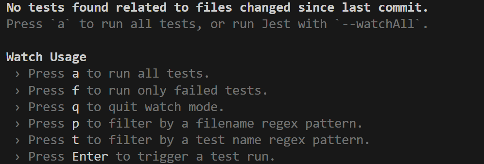
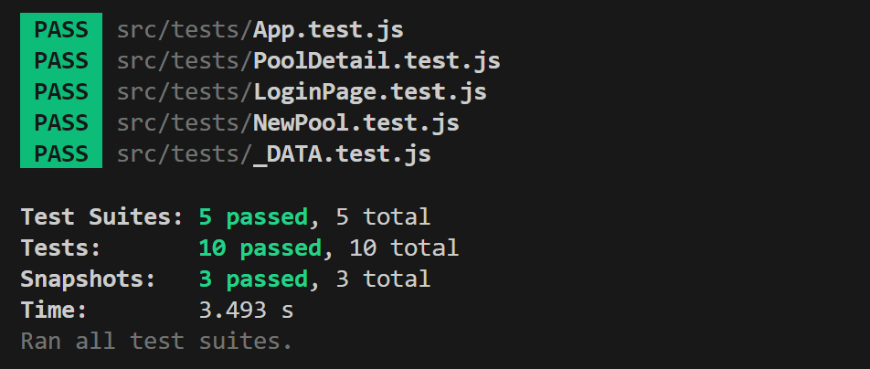

# Employee Polls Project

This repository contains the source code for the final assessment project for Udacity's React & Redux course.

It is a web dashboard developped to be used by employees of a big company with a initiative of Human Resources department. In order to improve collaboration and transparency within the company, every employee can access the application and create a poll with two proposed solutions. Employees can then vote on these solutions and see which solutions have the most votes. In addition, HR has requested you have a dashboard that lists every employee ordered by the number of polls they've created and answered. To give employees incentive to use your application, HR will give a prize each quarter for the top employees who have created and answered the most polls.

# How to install

The entire dashboard was built using JavaScript and Node JS. For this reason, to install the application, it is necessary to install: 
* [Node JS](https://nodejs.org/en/), version 20.11.1.
* A modern webbrowser as [Chrome](https://www.google.com/chrome/).

Once satisfying the requirements, it is necessary to install the project dependencies and launch the application. For this, you should:

1. Navigate to the folder `employee-pool`
2. Run `npm install` to install dependencies.
3. Run `npm start` to start the development server.

After these steps, you should see the web dashboard running on the a localhost at port 3000, as shown in the Figure below.

# Code structure overview

The entire code of the dashboard is located in the folder `/employee-pool/src`. The code follows a modular structure that was divided into 8 parts, notably:

* __CSS__: it countains the file responsible for defining the style of the user interface (UI). It defines the color, shape, and location of each component composing the UI.
* __Components__: it contains all the react components composing the entire UI. The components were divide to be simple and reusable.
* __Actions__: it contains all action creators that are used in the web dashboard. 
* __Images__: it contains all images used int the web dashboard, especially the avatar images.
* __Middleware__: it contains all the middlewares. In this project it is used only the _thunk_ middleware.
* __Reducers__: it contains all the reducers used in the dashboard.
* __Test__: it contains all test files. There are at least 10 test assessment to guarantee the quality of the dashboard.
* __Utils__: it contains the database API (`DATA_.js`). It is a facke database used to mimic the real behaviour of a database. It emulates the asynchronous behaviour of real databases.

# Unit Tests

All unit tests can be launched by using `npm run test` and by pressing `a` to select run all existing unit tests. The unit tests are located in the folder `employee-pool/tests`. The figure below show the menu indicating that the tests are going to be lauched.

By selecting `a`, it is possible to see the results of tests:

